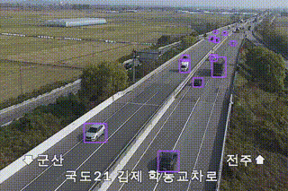
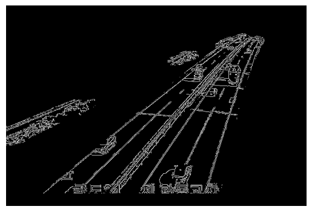
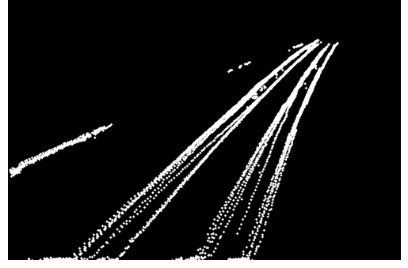
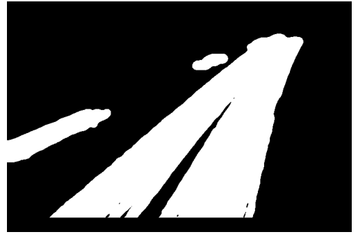
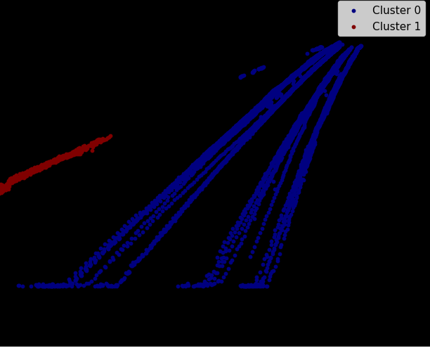

# Lane detection based on car detection & tracking

## results
### road proposal

- notice: this proposal isn't precise and also in process of being completed  

### lane detect with canny edge detection
  *in progress*  

## methods
  1. make hitmap based on driving trajectory(considered direction)
   
  2. applying gaussian filter to make wider distribution of pixel
   
  3. identifying main roads using DBSCAN clustering
   
  4. applying edge detection algorithm(in this case canny edge)
   

